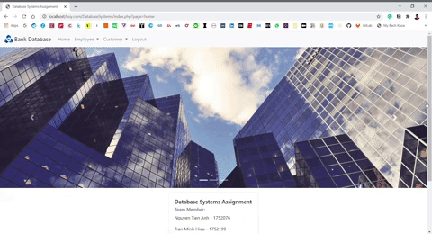

# Bank Database Website

## Prerequisites
### XAMPP
- Install XAMPP: [Link](https://www.apachefriends.org/index.html)

### SQL Server Management Studio
- Install SQL Server Management Studio: [Link](https://docs.microsoft.com/en-us/sql/ssms/download-sql-server-management-studio-ssms?view=sql-server-ver15)

### Microsoft Drivers for PHP for SQL Server
- Install Microsoft Drivers for PHP for SQL Server into `C:\xampp\php\ext` folder: [Link](https://docs.microsoft.com/en-us/sql/connect/php/download-drivers-php-sql-server?view=sql-server-ver15)
- Open `php.ini` (You can open with XAMPP in the `Apache Config` menu)
- Check your PHP version by create this `phpinfo.php` and open it on your browser:
```
<?php
    echo phpinfo()
?>
```
- Find `Dynamic Extensions` section and add these line (Depend on your PHP version, in my example, my PHP version is `7.4`):
```
extension=php_pdo_sqlsrv_74_ts_x64.dll
extension=php_sqlsrv_74_ts_x64.dll
```
### Check your installation
Create `test.php`:
```
<?php
// Test connection
$server_name = "bankingdb-hcmut.database.windows.net";

$connection = array("Database"=>"BankingDB", "UID"=>"user", "PWD"=>"12345");

$conn = sqlsrv_connect($server_name, $connection);

if ($conn) {
    echo "Connection established: " . $server_name;
}
else {
    echo "Connection could not be established";
    die(print_r(sqlsrv_errors(), true));
}
?>
```

## Usage

- Start the PHP server on XAMPP.
- Open a browser.
- Go to `http://localhost/DatabaseSystems`.
- Log in to the website.
    - Username: manager_login_test1 (Read and Write Only)
    - Password: Test4321!!!
    - Username: bankowner (Admin)
    - Password: Test1234
- Demo video: [Link](https://youtu.be/8jss3I__23A)

<p align="center">
  
</p>
